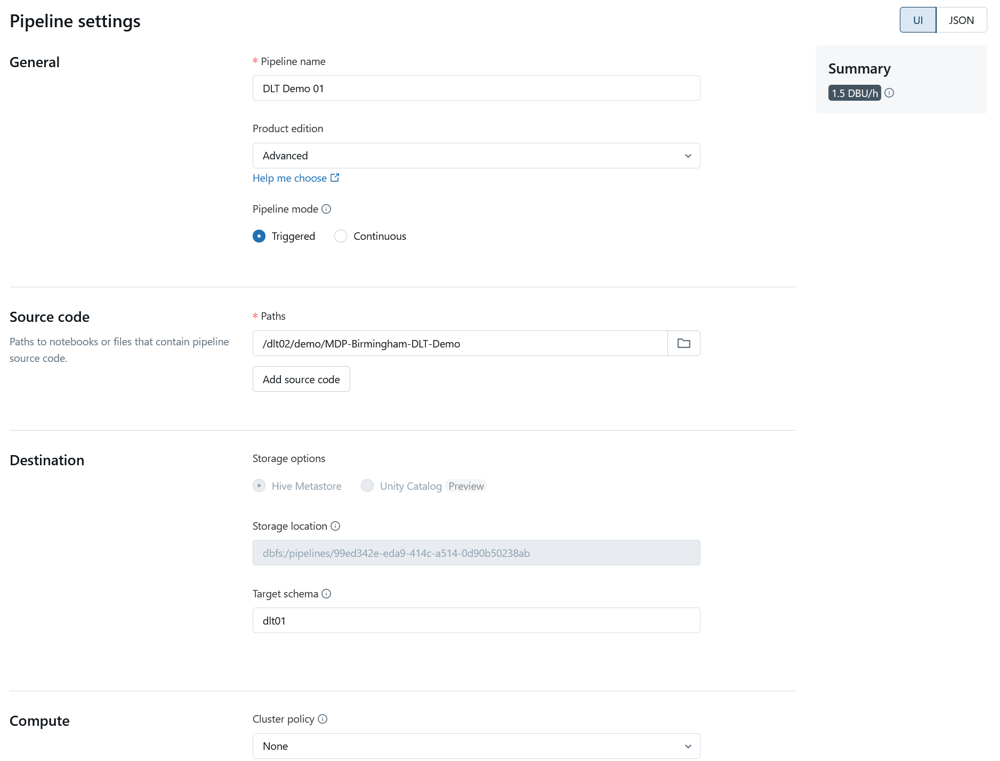

# Delta Live Tables: Building reliable data pipelines

In this engaging session, we explore Delta Live Tables (DLT) and its significant impact on current data analytics platforms.

Delta Live Tables from Azure Databricks simplifies the process of creating robust and maintainable data processing pipelines. With this declarative framework, it is easier to manage complex data transformations, monitoring, data quality, and error handling.

## Features

- **Declarative Pipeline Framework**: Simplifies the creation and management of data pipelines.
- **Data Quality Monitoring**: Automatically monitors data quality and alerts on anomalies.
- **Error Handling**: Built-in error handling ensures robust data processing.
- **Scalable and Performant**: Optimized for performance and scalability in large data environments.

## Benefits

- **Ease of Use**: Simplifies complex ETL processes.
- **Maintainability**: Easier to manage and update pipelines.
- **Reliability**: Ensures high data quality and robust error handling.
- **Integration**: Seamlessly integrates with Azure Databricks and other Azure services.

## Getting Started

### Prerequisites

- Azure Databricks Workspace
- Databricks Runtime with Delta Lake

### Setup

1. **Create a Databricks Workspace**:
   - Sign in to the Azure portal.
   - Navigate to the Databricks service and create a new workspace.
  
2. **Clone the Repository**:
   ```bash
   git clone https://github.com/KRSNagaraj/Delta-Live-Tables-Building-Reliable-Data-Pipelines.git
   cd Delta-Live-Tables-Building-Reliable-Data-Pipelines
   ```

3. **Install Required Libraries**:
   - Ensure that the Delta Lake libraries are installed in your Databricks cluster.

4. **Create Delta Live Tables**:
   - Open Databricks and navigate to the **Delta Live Tables** section.
   - Create a new pipeline and configure the necessary settings.

## Usage

1. **Define Your Tables**: Create python or SQL scripts to define your data transformations.
2. **Deploy the Pipeline**: Use the Databricks interface to deploy and monitor your DLT pipelines.
3. **Monitor and Manage**: Use the built-in tools to monitor data quality, track errors, and manage your data pipeline.

## Screenshots

### DLT Pipeline Results


### DLT Settings Page


